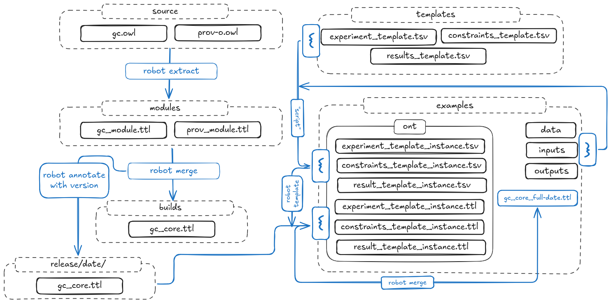

# Molecular Modelling Project Ontology (ont_mm)

A domain ontology for representing and structuring molecular modelling workflows, with a focus on **traceability**, **reproducibility**, and **data integration**.

## 🚀 Quick Start

👉 **New here? Start with the working example:**

examples/

Follow the guide in:

examples/README.md

In a few minutes, you will:

* Generate ontology instances from templates
* Build a complete workflow graph
* Run a working SPARQL query

This is the fastest way to understand how the ontology works in practice.

## Overview

Molecular modelling projects generate complex networks of files, parameters, and results. While these are often stored in well-defined directory structures, the relationships between them are rarely captured in a formal, machine-readable way.

This project develops an ontology to represent those relationships as a graph, enabling structured understanding of how modelling work is organised, executed, and interpreted.

The focus is on **pre-publication computational workflows** —the exploratory phase where models are built, tested, and refined.

## Motivation

Typical challenges in molecular modelling projects include:

* Track provenance of computed results
* Reproduce calculations reliably
* Understand dependencies between inputs, methods and outputs

This ontology addresses these by providing a formal framework linking:

* Files
* Computational constraints
* Generated results

## Scope

### 1. Files

* File types and naming conventions
* Relationships (inputs, outputs, intermediates)
* File dependencies within workflows

### 2. Constraints

* Computational methods and parameters
* Assumptions and modelling conditions
* Simulation configurations

### 3. Results

* Output data and derived properties
* Links to originating inputs and constraints
* Metadata for interpretation and validation

## Objectives

* Define a consistent schema for molecular modelling projects
* Enable full traceability from results back to inputs
* Support reproducible and reusable computational workflows

## Approach

The ontology builds on established standards:

Gainesville Core Ontology (GC) for domain concepts
PROV-O for provenance modelling

Relevant terms are extracted, modularised, and combined into a coherent domain ontology.

## Repository Structure

*(To be defined as the project evolves)*

ont_mm
|--builds				# Combined ontology outputs
|  |--gc_core.ttl
|  |--README.md
|--docs					# Supporting queries and term lists
|  |--fix_annotations.sparql
|  |--fix_license.sparql
|  |--fix_label.sparql
|  |--gc_terms.txt
|  |--prov_terms.txt
|--examples				# a worked example
|  |--data
|  |  |--rem01.dat
|  |  |--rem01a.dat
|  |  |--rem01b.dat
|  |--inputs
|  |  |--rem01.inp
|  |  |--rem01a.inp
|  |  |--rem01b.inp
|  |--ont
|  |  |--constraint_template_instances.tsv
|  |  |--constraint__template.ttl
|  |  |--experiment_template_instances.tsv
|  |  |--experiment_template.ttl
|  |  |--gc_core_full.ttl
|  |  |--results_template_instances.tsv
|  |  |--results_template.ttl
|  |--outputs
|  |  |--rem01.log
|  |  |--rem01a.log
|  |  |--rem01b.log
|  |--README.md
|--images
|  |--ont_mm_scheme1.excalidraw
|  |--ont_mm_scheme1.png
|--modules				# Extracted ontology modules
|  |--gc_module.ttl
|  |--prov_module.ttl
|  |--README.md
|--ReadMe.md
|--releases				# versioned ontologies
|  |--2026-05-08
|  |  |--gc_core.ttl
|--scripts				# Processing and build scripts
|--source				# Source ontologies
|  |--catalog-v001.xml
|  |--EMPTY.owl
|  |--gc.owl				# Gainesville Core ontology
|  |--prov-o.owl			# Provenance ontology
|--templates				# Ontology templates
|  |--constraint_template.tsv
|  |--experiment_template.tsv
|  |--results_template.tsv

## Current Status

Early-stage development:

* Core structure defined
* Term extraction pipeline in place
* Initial ontology modules created
* Templates in place
* Worked example

## Future Work

* Expand ontology coverage
* Integrate with analysis tools (e.g. R workflows)
* create sparql queries for testing

## Long-term vision

To provide a reusable, extensible framework for structuring computational chemistry projects, bridging raw simulation data with higher-level analysis and interpretation.

## Author

[Darren Rhodes]

## License

(To be defined — e.g. MIT recommended)

## TOOLS

[Gamess (US)](https://www.msg.chem.iastate.edu/gamess/)
[robot](https://robot.obolibrary.org/)
[RStudio](https://posit.co/download/rstudio-desktop)
[turtle viewer](https://semantechs.co.uk/turtle-editor-viewer/)

