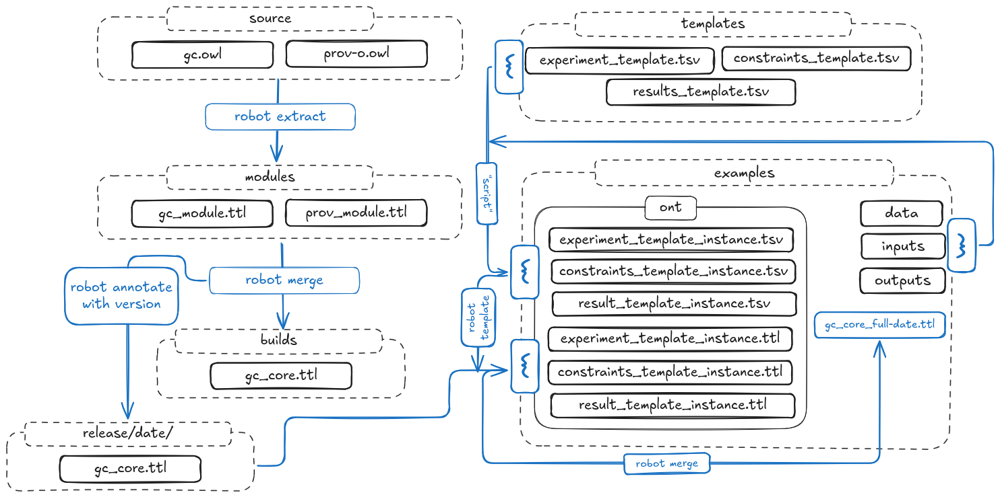

# Molecular Modelling Project Ontology (ont_mm)

A domain ontology for representing and structuring molecular modelling workflows, with a focus on **traceability**, **reproducibility**, and **data integration**.

## 🧪 Using This With Your Own Data

This is the part you actually want if you have your own GAMESS input/output
files and want to build and query your own instantiated ontology from them.
(If you just want to see how the bundled example was built, see
`examples/README.md` instead - that's a construction history, not a
usage guide, which is why this section exists separately.)

### 1. Get the code

Clone both repos:

```bash
git clone https://github.com/Darren01/gamess_functions.git
git clone https://github.com/Darren01/ont_mm.git
```

This is the simplest, most reliable option and needs nothing beyond `git`
itself - use it if you're not sure which option to pick.

**Alternative, if you'd rather not clone**: base R can fetch and source a
file straight from GitHub without installing anything extra:

```r
lines <- readLines("https://raw.githubusercontent.com/Darren01/gamess_functions/master/R/gamess_input_utils.R", warn = FALSE)
source(textConnection(lines))
```

Note the branch name in the URL is `master`, not `main`.

(You may see `devtools::source_url()` suggested elsewhere for this same
task - it works, but pulls in a large dependency chain that can fail for
reasons unrelated to this project, e.g. version conflicts between
`devtools` and packages you already have installed. The plain
`readLines()` + `source(textConnection(...))` approach above needs
nothing beyond base R and is the one actually confirmed working here.)

Optional: if you want a snapshot that won't change even as this project
keeps being developed, replace `master` in any URL above with a specific
commit's ID instead - the short code (e.g. `a1b2c3d`) shown next to each
entry on the repo's "commits" page on GitHub.

### 2. Classify your files first - just to see what's there

Before running anything else, get a quick inventory of what job types
you actually have:

```r
source("gamess_functions/R/classify_gamess_jobs.R")
classify_gamess_jobs("/path/to/your/output/folder")
```

This alone is a useful sanity check - confirms the code recognises your
files before you commit to a full build.

### 3. Build the instance data

Source everything `process_gamess_directory()` depends on:

```r
source("gamess_functions/R/gamess_input_utils.R")
source("gamess_functions/R/classify_gamess_jobs.R")
source("gamess_functions/R/extract_ir_spectrum.R")
source("gamess_functions/R/extract_ir_diagnostics.R")
source("gamess_functions/R/extract_thermochemistry.R")
source("gamess_functions/R/extract_electronic_energy.R")
source("gamess_functions/R/extract_irc_trajectory.R")
source("gamess_functions/R/combine_irc_trajectories.R")
source("gamess_functions/R/extract_constraints.R")
source("gamess_functions/R/check_vibrational_quality.R")
source("gamess_functions/R/ir_spectrum_to_templates.R")
source("gamess_functions/R/thermochemistry_to_templates.R")
source("gamess_functions/R/electronic_energy_to_templates.R")
source("gamess_functions/R/reaction_path_to_templates.R")
source("gamess_functions/R/constraints_to_templates.R")
source("ont_mm/scripts/build_provenance.R")
source("ont_mm/scripts/process_experiments.R")
source("ont_mm/scripts/process_results.R")
source("ont_mm/scripts/process_thermo_results.R")
source("ont_mm/scripts/process_electronic_energy_results.R")
source("ont_mm/scripts/process_reaction_path_results.R")
source("ont_mm/scripts/process_contraints.R")
source("ont_mm/scripts/process_gamess_directory.R")
```

then run it against your own folders:

```r
result <- process_gamess_directory(
  input_dir  = "/path/to/your/input/folder",   # .inp files
  output_dir = "/path/to/your/output/folder",  # .log files
  ontology_dir = "/path/to/where/you/want/the/instance/data",
  experiment_template_file = "ont_mm/templates/experiment_template.tsv"
)
```

**If your data is confidential**, point `ontology_dir` at a folder
*outside* any git repository entirely - not a subfolder of `ont_mm`,
even one you plan to `.gitignore`. A folder with no repo at all is a
structural guarantee nothing can accidentally end up on GitHub; a
gitignore rule is just a reminder you have to get right every time.

This writes instance TSV files - it does not yet produce a queryable
graph. That's the next step.

### 4. Build the queryable graph

```r
source("ont_mm/scripts/build_ontology_graph.R")

build_ontology_graph(
  ontology_dir = "/path/to/where/you/wrote/the/instance/data",
  release_file = "ont_mm/releases/2026-07-24/gc_core.ttl",  # latest release
  output_file  = "/path/to/your_graph.ttl"
)
```

Requires `robot` on your PATH. This automates the `robot template` +
`robot merge` sequence - it skips any template with no corresponding
instance data found, rather than erroring, so it's fine if your dataset
doesn't have every result type (e.g. no IRC data at all).

### 5. Query it

```r
source("gamess_functions/R/sparql_to_file.R")

# adjust the query - see gamess_functions/query_your_ontology.R for a
# fuller set of starting-point queries (experiments by type, imaginary
# frequencies, system energies, constraints, provenance chains)
sparql_query(
  graph_file = "/path/to/your_graph.ttl",
  query = "SELECT ?exp ?type WHERE { ?exp a ?type . }"
)
```

## 🚀 Quick Start (the bundled example)

👉 **New here? Start with the working example:**

examples/

Follow the guide in:

examples/README.md

In a few minutes, you will:

* Generate ontology instances from templates
* Build a complete workflow graph
* Run a working SPARQL query

This is the fastest way to understand how the ontology works in practice.

## Overview

Molecular modelling projects generate complex networks of files, parameters, and results. While these are often stored in well-defined directory structures, the relationships between them are rarely captured in a formal, machine-readable way.

This project develops an ontology to represent those relationships as a graph, enabling structured understanding of how modelling work is organised, executed, and interpreted.

The focus is on **pre-publication computational workflows** —the exploratory phase where models are built, tested, and refined.



---

## Motivation

Typical challenges in molecular modelling projects include:

* Track provenance of computed results
* Reproduce calculations reliably
* Understand dependencies between inputs, methods and outputs

This ontology addresses these by providing a formal framework linking:

* Files
* Computational constraints
* Generated results
* Experiment sequences

---

## Scope

### 1. Files

* File types and naming conventions
* Relationships (inputs, outputs, intermediates)
* File dependencies within workflows

### 2. Constraints

* Computational methods and parameters
* Assumptions and modelling conditions
* Simulation configurations

### 3. Results

* Output data and derived properties
* Links to originating inputs and constraints
* Metadata for interpretation and validation

---

## Objectives

* Define a consistent schema for molecular modelling projects
* Enable full traceability from results back to inputs
* Support reproducible and reusable computational workflows
* Bridge raw simulation data and semantic representations

---

## Approach

The ontology builds on established standards:

Gainesville Core Ontology (GC) for domain concepts
PROV-O for provenance modelling

Relevant terms are extracted, modularised, and combined into a coherent domain ontology.

Structured data is generated using:

- **ROBOT templates** (TSV → RDF/OWL)
- **R scripts** for parsing and transformation

---

## Template System (ROBOT)

All ontology instances are generated using ROBOT templates:

```text
Row 1	→	Human-readable headers
Row 2	→	ROBOT template script
Row 3+	→	Data
```

Example:

```text
ID	Label	Type	provWasGeneratedBy	hasInputFile	hasOutputFile	fileURL
ID	LABEL	TYPE	I prov:wasGeneratedBy	I ex:hasInputFile	I ex:hasOutputFile SPLIT=|	A ex:fileURL
```

---

## Scripted Workflow Generation (R)

The repository now includes a set of R scripts that automate the generation of ontology-ready data from molecular modelling project directories.

These scripts transform structured file systems (inputs, outputs, data) into **ROBOT template instances**, enabling reproducible and scalable ontology population.

### Overview of Scripts

Located in:

```text
scripts/
```

| Script                                | Purpose                                                      |
| ------------------------------------- | ------------------------------------------------------------ |
| `process_experiments.R`               | Generates experiment-level provenance and file relationships |
| `build_provenance.R`                  | Infers provenance chains from input file naming conventions  |
| `process_constraints.R`               | Extracts and structures computational constraints            |
| `provenance_enrichment_experiments.R` | Adds additional provenance relationships to experiment data  |
| `url_enrichment_experiments.R`        | Resolves and injects file URLs into experiment records       |

---

## Provenance Handling

A key feature of the workflow is **automatic provenance reconstruction**.

### Default Behaviour

If no provenance file is provided:

* The **first input file** in a sequence is assumed to originate from:

  ```
  ex:avogadro_build
  ```

* Subsequent files are linked sequentially:

  ```
  step_01 → step_01a → step_01b → step_02
  ```

* Each file is treated as being generated by the **previous experiment**, forming a provenance chain:

  ```
  ex:file_step_01a_inp → ex:exp_step_01
  ```

* If a break in sequence is detected:

  * Provenance resets to `ex:avogadro_build`

---

### Supported Naming Patterns

The provenance system detects workflow structure from filenames:

#### Numeric sequences

```
step_01 → step_02 → step_03
```

#### Sub-step sequences

```
step_01 → step_01a → step_01b → step_01c
```

#### Mixed progression

```
step_01 → step_01a → step_01b → step_02
```

---

### Optional Provenance File

Users may supply a provenance file to override inferred relationships.

Format (TSV):

```text
ID	provWasGeneratedBy
ex:file_step_02_inp	ex:manual_adjustment
```

#### Important behaviour

* The system **first builds a complete provenance graph automatically**
* The provenance file then **selectively overrides specific entries**
* Empty or missing values in the file are ignored
* Unknown IDs generate warnings

This ensures:

* No gaps in provenance
* Default chaining is preserved
* Manual corrections are safely applied

---

## Workflow Pipeline

A typical workflow is:

1. Prepare directory structure:

   ```
   inputs/
   data/
   outputs/
   ```

2. Run experiment processing:

   ```r
   process_experiments(...)
   ```

3. (Optional) Apply enrichment steps:

   ```r
   provenance_enrichment_experiments(...)
   url_enrichment_experiments(...)
   ```

4. Generate ROBOT template instances:

   ```
   *.tsv → RDF/OWL
   ```

---

## Design Principles

The scripting layer follows a few key principles:

* **Deterministic**: same inputs always produce the same graph
* **Recoverable**: provenance inferred from file structure
* **Override-safe**: manual inputs refine, not replace, defaults
* **Composable**: scripts can be run independently or chained

---

## Notes

* File ordering is determined by filename sorting — consistent naming (e.g. zero-padding) is recommended
* Provenance inference assumes structured naming conventions
* The system is designed for **lightweight workflow reconstruction**, not full workflow management

---


## Repository Structure

*(To be defined as the project evolves)*

```text
ont_mm
|--builds				# Combined ontology outputs
|  |--gc_core.ttl
|  |--README.md
|--docs					# Supporting queries and term lists
|  |--fix_annotations.sparql
|  |--fix_license.sparql
|  |--fix_label.sparql
|  |--gc_terms.txt
|  |--prov_terms.txt
|--examples				# a worked example
|  |--data
|  |  |--rem01.dat
|  |  |--rem01a.dat
|  |  |--rem01b.dat
|  |--inputs
|  |  |--rem01.inp
|  |  |--rem01a.inp
|  |  |--rem01b.inp
|  |--ont
|  |  |--constraint_template_instances.tsv
|  |  |--constraint_template.ttl
|  |  |--experiment_template_instances.tsv
|  |  |--experiment_template.ttl
|  |  |--gc_core_full.ttl
|  |  |--results_template_instances.tsv
|  |  |--results_template.ttl
|  |--ont_script
|  |  |--constraint_template_instances_script.tsv
|  |--outputs
|  |  |--rem01.log
|  |  |--rem01a.log
|  |  |--rem01b.log
|  |--README.md
|--images
|  |--ont_mm_scheme1.excalidraw
|  |--ont_mm_scheme1.png
|--modules				# Extracted ontology modules
|  |--gc_module.ttl
|  |--prov_module.ttl
|  |--README.md
|--README.md
|--releases				# versioned ontologies
|  |--2026-05-08
|  |  |--gc_core.ttl
|--scripts				# Processing and build scripts
|  |--build_provenance.R
|  |--process_experiments.R
|  |--process_constraints.R
|  |--provenance_enrichment_experiments.R
|  |--url_enrichment_experiments.R
|--source				# Source ontologies
|  |--catalog-v001.xml
|  |--EMPTY.owl
|  |--gc.owl				# Gainesville Core ontology
|  |--prov-o.owl			# Provenance ontology
|--templates				# Ontology templates
|  |--constraint_template.tsv
|  |--experiment_template.tsv
|  |--results_template.tsv
```

## Current Status

Early-stage but functional:

* Core ontology structure defined
* Term extraction pipeline implemented
* Initial ontology modules created
* Templates for experiments, constraints, and results
* R scripts for generating structured data
* Working end-to-end example

## Future Work

* Introduce SHACL validation for template checking
* Expand ontology coverage
* Improve provenance handling (edge cases)
* Extend results modelling
* Add more SPARQL queries for validation and analysis

## Long-term vision

To provide a reusable framework for structuring computational chemistry workflows as semantic graphs, enabling:

* Reproducibility
* Provenance tracking
* Integration with knowledge systems
* Advanced querying and analysis

## Author

[Darren Rhodes]

## License

This project is licensed under the MIT License – see the [LICENSE](./LICENSE.txt) file for details.

## TOOLS

- [Gamess (US)](https://www.msg.chem.iastate.edu/gamess/)
- [robot](https://robot.obolibrary.org/)
- [RStudio](https://posit.co/download/rstudio-desktop)
- [turtle viewer](https://semantechs.co.uk/turtle-editor-viewer/)


