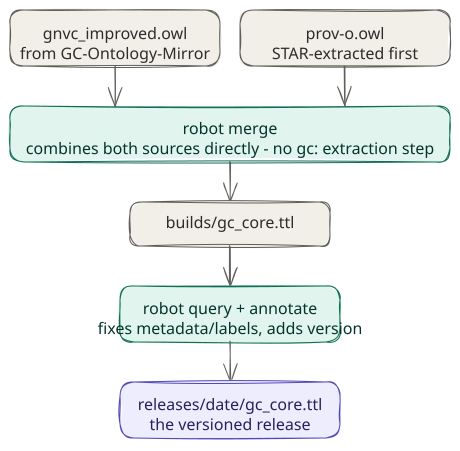
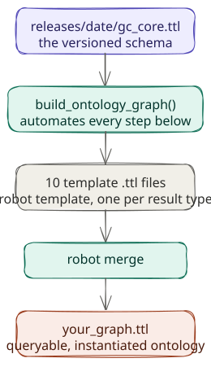

# Molecular Modelling Project Ontology (ont_mm)

A domain ontology for representing and structuring molecular modelling workflows, with a focus on **traceability**, **reproducibility**, and **data integration**.

## 🔍 What you actually get

Once your GAMESS runs are built into a queryable graph, this is the
payoff - no SPARQL required, one function call:

```r
source("gamess_functions/R/summarize_graph.R")
summarize_graph("examples/ont/gc_core_full_20260802.ttl")
```

```
=== Summary of gc_core_full_20260802.ttl ===

Experiments: 3
GeometryOptimization  VibrationalAnalysis
                   2                    1

Your own review notes: 0

Imaginary (negative) frequencies found: 0

Constraints: 6
```

This bundled example is a small, 3-experiment demo - genuinely 0
annotations and 0 imaginary frequencies here, honestly reported rather
than dressed up, since nobody's added review notes to it and nothing
in it happens to be a non-minimum geometry. On a real, actively-used
project, these same two lines are usually where the useful signal
shows up: your own notes on what actually happened surfaced directly
from the graph, and a flag for any geometry worth double-checking -
both without writing a single SPARQL query. If you want more specific
answers than that, `gamess_functions/examples/query_your_ontology.R`
has a tiered path from copy-paste templates through to writing your
own SPARQL, with a short primer built entirely from real lessons this
project actually hit along the way.

## 🧪 Using This With Your Own Data

This is the part you actually want if you have your own GAMESS input/output
files and want to build and query your own instantiated ontology from them.
(If you just want to see how the bundled example was built, see
`examples/README.md` instead - that's a construction history, not a
usage guide, which is why this section exists separately.)

### 1. Get the code

Two genuinely separate options - pick one and use it consistently for
every file below. Mixing them (sourcing one file by URL, then trying to
`source("gamess_functions/...")` as a local path without having cloned)
is the single most common mistake here - that local path only exists if
you actually cloned.

**Option A - clone (simplest, recommended if unsure):**

**Important: this is a shell/terminal command, not R code.** Run it in
a terminal (Command Prompt, PowerShell, Git Bash, or similar) - pasting
it into an R console will fail, since R doesn't understand `git` as a
command by itself. Note *where* you run this from - that folder is
`my_code_dir` below.

```bash
git clone https://github.com/Darren01/gamess_functions.git
git clone https://github.com/Darren01/ont_mm.git
```

**Option B - no cloning, fetch each file from GitHub directly:**

This part *is* R code - run it in your R console, not a terminal.

```r
source_github <- function(repo, path, branch = "master") {
  url <- paste0("https://raw.githubusercontent.com/Darren01/", repo, "/", branch, "/", path)
  lines <- readLines(url, warn = FALSE)
  source(textConnection(lines))
}

source_all_github <- function(paths, branch = "master") {
  for (p in paths) {
    parts <- strsplit(p, "/", fixed = TRUE)[[1]]
    repo <- parts[1]
    rest <- paste(parts[-1], collapse = "/")
    source_github(repo, rest, branch = branch)
  }
}
```

Define both once here. Step 3 below gives the actual list of files as a
single `paths` vector, used either with a plain loop (if you cloned) or
with `source_all_github(paths)` (if you didn't) - same list either way,
nothing to duplicate or hand-edit.

(You may see `devtools::source_url()` suggested elsewhere for this same
task - it works, but pulls in a large dependency chain that can fail for
reasons unrelated to this project, e.g. version conflicts between
`devtools` and packages you already have installed. `source_github()`
above needs nothing beyond base R.)

Optional: if you want a snapshot that won't change even as this project
keeps being developed, pass a specific commit's ID as `branch` instead
of relying on the default `"master"` - the short code (e.g. `a1b2c3d`)
shown next to each entry on the repo's "commits" page on GitHub.

### 1b. Set your paths once

Every step below uses these same variables - set them here, once, and
nothing further down needs a path retyped or re-pasted. This is also
where a very common, confusing failure gets prevented up front: every
`source("gamess_functions/...")` example elsewhere assumes R's current
working directory *is* the folder you cloned into - if it isn't (e.g.
you're running R from a different project folder), those relative
paths silently fail with a "file not found" error that gives no hint
why. `my_code_dir` below fixes that regardless of where you're
actually running R from.

```r
# strip_trailing_slash: R's file.path() doesn't collapse a trailing
# slash you've already included, producing a literal, confusing
# double-slash ("./ontology//gc_core.ttl") if you happen to type one.
# Applying this once here means it doesn't matter either way.
strip_trailing_slash <- function(x) sub("/+$", "", x)

# Defines source_github()/source_all_github() if they're not already
# present in this session - relevant whichever option you're using.
# Option A (cloned) doesn't strictly need these, but defining them costs
# nothing and does no harm; Option B genuinely needs them, and may not
# have them yet even if Step 1's own block already ran once - e.g. if
# you're resuming a session, or jumped straight here. Found necessary
# in practice for both options, not just a theoretical edge case.
if (!exists("source_github")) {
  source_github <- function(repo, path, branch = "master") {
    url <- paste0("https://raw.githubusercontent.com/Darren01/", repo, "/", branch, "/", path)
    lines <- readLines(url, warn = FALSE)
    source(textConnection(lines))
  }
}
if (!exists("source_all_github")) {
  source_all_github <- function(paths, branch = "master") {
    for (p in paths) {
      parts <- strsplit(p, "/", fixed = TRUE)[[1]]
      repo <- parts[1]
      rest <- paste(parts[-1], collapse = "/")
      source_github(repo, rest, branch = branch)
    }
  }
}

# Option A (cloned): the folder containing both gamess_functions/ and
# ont_mm/ as subfolders - wherever you ran `git clone` from in Step 1.
my_code_dir <- strip_trailing_slash("/path/to/wherever/you/cloned/both/repos")

my_input_dir     <- strip_trailing_slash("/path/to/your/input/folder")    # .inp files
my_output_dir    <- strip_trailing_slash("/path/to/your/output/folder")   # .log files
my_ontology_dir  <- strip_trailing_slash("/path/to/where/you/want/the/instance/data")
my_graph_file    <- file.path(my_ontology_dir, "your_graph_YYYYMMDD.ttl")   # dated, same convention as releases/
my_release_file  <- file.path(my_ontology_dir, "gc_core.ttl")

# Option A (cloned):
my_experiment_template <- file.path(my_code_dir, "ont_mm/templates/experiment_template.tsv")
# Option B (no clone) - read.delim() can read a URL directly, no
# download needed (confirmed - unlike release_file below, which does
# need a real local file). Comment out the Option A line above if
# using this instead:
# my_experiment_template <- "https://raw.githubusercontent.com/Darren01/ont_mm/master/templates/experiment_template.tsv"
```

**If your data is confidential**, make sure `my_ontology_dir` points at
a folder *outside* any git repository entirely - not a subfolder of
`ont_mm`, even one you plan to `.gitignore`. A folder with no repo at
all is a structural guarantee nothing can accidentally end up on
GitHub; a gitignore rule is just a reminder you have to get right every
time.

```r
dir.create(my_ontology_dir, recursive = TRUE, showWarnings = FALSE)
```

### 1c. Check `robot` works before doing anything else

Worth doing now, before Steps 2-3, not after - there's no point
spending time classifying files and building instance data only to
discover at Step 4 that `robot` itself doesn't work.

**Option A (cloned):**
```r
source(file.path(my_code_dir, "ont_mm/scripts/check_robot_setup.R"))
```

**Option B (no clone):**
```r
source_github("ont_mm", "scripts/check_robot_setup.R")   # source_github defined above
```

This catches two real issues found testing on a locked-down Windows
machine: Java 11+ is required (an older default Java on PATH, even
with a newer one also installed, gives a confusing, unrelated-looking
failure deep inside a build rather than a clear version error), and
confirms `robot` itself is actually callable.

```r
check_robot_setup()
# If it reports the wrong Java version and you have a compatible one
# installed elsewhere, point at it directly rather than fighting PATH:
# check_robot_setup(java_path = "C:/path/to/java11/bin/java.exe")
```

### 2. Classify your files first - just to see what's there

Before running anything else, get a quick inventory of what job types
you actually have.

**Option A (cloned):**
```r
source(file.path(my_code_dir, "gamess_functions/R/classify_gamess_jobs.R"))
```

**Option B (no clone):**
```r
source_github("gamess_functions", "R/classify_gamess_jobs.R")   # defined in Step 1
```

Either way:
```r
classify_gamess_jobs(my_output_dir)
```

This alone is a useful sanity check - confirms the code recognises your
files before you commit to a full build.

### 3. Build the instance data

One list of files, defined once - loop over it however matches how you
got the code in Step 1.

```r
paths <- c(
  "gamess_functions/R/gamess_input_utils.R",
  "gamess_functions/R/classify_gamess_jobs.R",
  "gamess_functions/R/extract_ir_spectrum.R",
  "gamess_functions/R/extract_ir_diagnostics.R",
  "gamess_functions/R/extract_thermochemistry.R",
  "gamess_functions/R/extract_electronic_energy.R",
  "gamess_functions/R/extract_irc_trajectory.R",
  "gamess_functions/R/combine_irc_trajectories.R",
  "gamess_functions/R/extract_constraints.R",
  "gamess_functions/R/check_vibrational_quality.R",
  "gamess_functions/R/geometry_to_atoms.R",
  "gamess_functions/R/ir_spectrum_to_templates.R",
  "gamess_functions/R/thermochemistry_to_templates.R",
  "gamess_functions/R/electronic_energy_to_templates.R",
  "gamess_functions/R/reaction_path_to_templates.R",
  "gamess_functions/R/constraints_to_templates.R",
  "ont_mm/scripts/build_provenance.R",
  "ont_mm/scripts/process_experiments.R",
  "ont_mm/scripts/process_results.R",
  "ont_mm/scripts/process_thermo_results.R",
  "ont_mm/scripts/process_electronic_energy_results.R",
  "ont_mm/scripts/process_reaction_path_results.R",
  "ont_mm/scripts/process_contraints.R",
  "ont_mm/scripts/process_gamess_directory.R"
)
```

**Option A (cloned):**

```r
for (p in file.path(my_code_dir, paths)) source(p)
```

**Option B (no clone):**

```r
source_all_github(paths)   # defined in Step 1
```

Either way, run it against your own folders:

```r
result <- process_gamess_directory(
  input_dir  = my_input_dir,
  output_dir = my_output_dir,
  ontology_dir = my_ontology_dir,
  experiment_template_file = my_experiment_template
)
```

This writes instance TSV files - it does not yet produce a queryable
graph. That's the next step.

### 3b. Optional: add your own review notes

Once you've actually looked at some results and formed an opinion -
"this run's constraints broke the geometry," "started from the hydrate
with a view to stretching a bond" - that's exactly the kind of thing
worth recording *in* the ontology, not just in your own head or a
separate notes file. This is a real, existing part of the pipeline,
not a suggestion for later.

Keep a plain `run_notes.tsv` file (tab-separated, `filename<TAB>your
comment`) somewhere in your project - e.g. alongside your other `ont/`
files:

```
caa002b.log	initial runs where 8,3 distance at 2A was too quick and broke up the molecule
caa004a.log	starting from the hydrate with a view to stretching one of the CO bonds
```

**Optional third field**: if a run was based on, or is being compared
against, a specific paper, add its DOI (pipe-separated for more than
one) as a third tab-separated field:

```
caa004a.log	starting from the hydrate with a view to stretching one of the CO bonds	10.1021/ja00249a034
```

This gets written as a real `dcterms:relation` to the paper's own
resolvable `https://doi.org/...` URL - see
[papers_ontology](https://github.com/Darren01/papers_ontology) for the
other side of this link. The two directions are genuinely independent,
not automatically bidirectional: this links *from* the experiment
*to* the paper; linking the paper back to the experiment is a separate
step, done in `papers_ontology`'s own `doi_notes.tsv`.

A line must have exactly 2 or exactly 3 tab-separated fields - not "2
or more, treat everything after the first tab as the comment," which
is how earlier versions of this worked. A comment containing a literal
tab character would now be (correctly) flagged as ambiguous rather
than silently absorbed - unlikely in practice for hand-typed free
text.

**Option A (cloned):**
```r
source(file.path(my_code_dir, "gamess_functions/R/notes_to_annotations.R"))
```

**Option B (no clone):**
```r
source_github("gamess_functions", "R/notes_to_annotations.R")
```

Either way:
```r
rows <- notes_to_annotations(file.path(my_ontology_dir, "run_notes.tsv"))
write_annotations(rows, file.path(my_ontology_dir, "annotation_template_instances.tsv"))
```

**This only writes a TSV file - it does not touch your queryable graph.**
Your notes won't show up in any query until you go back and re-run
Step 4's `build_ontology_graph()` afterward, same as any other change
to your instance data.

**You'll likely come back to this step more than once, and that's the
intended workflow, not a workaround** - reviewing your results as a
whole (e.g. via `summarize_graph()`) often surfaces things worth
recording that weren't obvious when a run first finished. Editing
`run_notes.tsv` and re-running the two commands above at any later
time is completely safe: `write_annotations()` always regenerates the
file fresh from your notes' *current* full content, rather than
appending - so revisiting old notes, adding new ones, or both, never
duplicates anything already recorded.

Each note attaches as a real `rdfs:comment` on the corresponding
experiment - a standard, well-understood RDFS annotation property, not
something invented for this project. `build_ontology_graph()` in the
next step picks this file up automatically alongside everything else,
as long as it's sitting in `my_ontology_dir` under this exact filename.

### 4. Build the queryable graph

**Option A (cloned):**
```r
source(file.path(my_code_dir, "ont_mm/scripts/build_ontology_graph.R"))
```

**Option B (no clone):**
```r
source_github("ont_mm", "scripts/build_ontology_graph.R")   # defined in Step 1
```

(`robot` was already checked back in Step 1c - if that passed, you're
good to continue here without re-checking.)

`release_file` needs to be a genuine local file either way - it's
passed to `robot`, a separate external program, not read by R itself,
so R's URL-reading convenience (which worked for
`experiment_template_file` above) doesn't apply here. If you didn't
clone, download it first, into `my_ontology_dir` (already set up above):

```r
download.file(
  "https://raw.githubusercontent.com/Darren01/ont_mm/master/releases/2026-08-08/gc_core.ttl",
  destfile = my_release_file
)
```

**On a corporate network, this may fail with an SSL error** (e.g.
`SSL connect error` from a TLS-inspecting proxy such as Fortinet,
Zscaler, or similar - these decrypt and re-sign HTTPS traffic with
their own internal certificate, which R's bundled certificate store
doesn't trust, even though Windows' own certificate store usually
does). Try this first, since it uses Windows' own trust store rather
than disabling certificate checking:

```r
download.file(
  "https://raw.githubusercontent.com/Darren01/ont_mm/master/releases/2026-08-08/gc_core.ttl",
  destfile = my_release_file,
  method = "wininet"
)
```

If that still fails and you have WSL available, this is a confirmed
working fallback - note it does disable certificate verification
(`--no-check-certificate`), which is reasonable for this specific,
known-safe file but shouldn't become a habit for downloading things in
general:

```r
system(paste0(
  "wsl wget --no-check-certificate -O ", my_release_file,
  " https://raw.githubusercontent.com/Darren01/ont_mm/master/releases/2026-08-08/gc_core.ttl"
))
```

Then:

```r
build_ontology_graph(
  ontology_dir = my_ontology_dir,
  release_file = my_release_file,
  output_file  = my_graph_file
)
```

This automates the `robot template` + `robot merge` sequence - it skips
any template with no corresponding instance data found, rather than
erroring, so it's fine if your dataset doesn't have every result type
(e.g. no IRC data at all).

**If this reports "No templates were successfully built"**, it means
Step 3 never actually produced any `*_template_instances.tsv` files in
`my_ontology_dir` - check Step 3 completed without an error before
troubleshooting this step, rather than the other way round.

### 5. Query it

**Option A (cloned):**
```r
source(file.path(my_code_dir, "gamess_functions/R/sparql_to_file.R"))
```

**Option B (no clone):**
```r
source_github("gamess_functions", "R/sparql_to_file.R")   # defined in Step 1
```

```r
# This is a deliberately minimal placeholder to confirm the connection
# works - it has no filter, so it matches EVERY typed subject in the
# whole graph: your actual experiments and results, but also every
# class/property in the merged ontology schema itself (they're all one
# graph). That's expected, not a bug - it's just not the useful
# starting query. For that, see gamess_functions/query_your_ontology.R,
# whose first example filters down to just your own experiments by type.
sparql_query(
  graph_file = my_graph_file,
  query = "SELECT ?exp ?type WHERE { ?exp a ?type . }"
)
```

### 5b. Building additional projects

Everything above is a one-time setup - `my_code_dir` and `release_file`
don't change per project, only your actual data does. Once Steps 1-1c
are done, building (or rebuilding) a *different* project doesn't need
the full walkthrough again - just fresh data paths and one call:

```r
my_input_dir    <- "/path/to/a/different/project/inputs"
my_output_dir   <- "/path/to/a/different/project/outputs"
my_ontology_dir <- "/path/to/a/different/project/ont"
my_graph_file   <- file.path(my_ontology_dir, "your_graph_YYYYMMDD.ttl")

# Option A (cloned):
source(file.path(my_code_dir, "ont_mm/scripts/build_provenance.R"))
source(file.path(my_code_dir, "ont_mm/scripts/process_experiments.R"))
# ...(the rest of Step 3's paths list, all sourced the same way)

# Option B (no clone):
# source_all_github(paths)   # the same paths vector from Step 3

result <- process_gamess_directory(
  input_dir  = my_input_dir,
  output_dir = my_output_dir,
  ontology_dir = my_ontology_dir,
  experiment_template_file = my_experiment_template
)

source(file.path(my_code_dir, "ont_mm/scripts/build_ontology_graph.R"))
build_ontology_graph(
  ontology_dir = my_ontology_dir,
  release_file = release_file,
  output_file  = my_graph_file
)
```

Worth keeping a short project-specific script like this saved
somewhere for each real project you work on (outside any git repo if
the data is confidential, same as always) - it becomes your quick
"rebuild this project" command whenever new runs are added, without
re-deriving the sequence from scratch each time.

### Step 5 (optional, recommended): validate the graph

`robot report` checks the *schema*'s own structural soundness -
missing labels, dangling references, and so on. It doesn't check
whether the *data* in a built graph actually makes sense - a
`gc:hasFloatValue` silently typed as `xsd:string` instead of
`xsd:float` passes a schema check cleanly, while quietly breaking
every numeric comparison query built against it. This project hit
exactly that bug, and a second one just like it, before
[SHACL](https://www.w3.org/TR/shacl/) validation existed to catch it
automatically.

[`shapes/gc_core_shapes.ttl`](./shapes/gc_core_shapes.ttl) holds real
shapes, each tied to a specific bug actually found in this project's
own development - not textbook examples. Run via
[`validate_graph_shacl()`](https://github.com/Darren01/gamess_functions/blob/master/R/validate_graph_shacl.R)
(in `gamess_functions`):

```r
source(file.path(my_code_dir, "gamess_functions/R/validate_graph_shacl.R"))

result <- validate_graph_shacl(
  graph_file  = my_graph_file,
  shapes_file = file.path(my_code_dir, "ont_mm/shapes/gc_core_shapes.ttl")
)
```

Requires `shacl` on your PATH (part of the [Apache
Jena](https://jena.apache.org/download/) command-line tools - a
separate download from `robot`, though both are Java-based, so no new
language runtime is needed). If `shacl` isn't reachable the same way
`robot` already is (e.g. it was only added to `PATH` via `.bashrc`,
which a GUI-launched RStudio session may never read), either symlink
it into the same location `robot` already lives in, or pass its full
path via `validate_graph_shacl()`'s own `shacl_cmd` argument.

One real, confirmed Jena quirk worth knowing about, already handled
for you inside `validate_graph_shacl()`: Jena's `shacl` script blindly
trusts a `JAVA_HOME` environment variable if one is set at all, with
no check that it actually points at a working Java install - unlike
`robot`, which doesn't reference `JAVA_HOME` anywhere in its own
script. A stale `JAVA_HOME` (pointing at a long-gone old Java version,
inherited from some part of your environment that may be hard to
track down) can make `shacl` fail outright even when a perfectly good,
current Java is available and `robot` itself works fine.
`validate_graph_shacl()` clears `JAVA_HOME` for the duration of the
`shacl` call only, and restores your original value afterwards - you
shouldn't need to do anything about this yourself, but if you ever
call `shacl` directly rather than through this wrapper and it fails
mysteriously, this is worth checking first.

## 🚀 Quick Start (the bundled example)

👉 **New here? Start with the working example:**

examples/

Follow the guide in:

examples/README.md

In a few minutes, you will:

* Generate ontology instances from templates
* Build a complete workflow graph
* Run a working SPARQL query

This is the fastest way to understand how the ontology works in practice.

## Overview

Molecular modelling projects generate complex networks of files, parameters, and results. While these are often stored in well-defined directory structures, the relationships between them are rarely captured in a formal, machine-readable way.

This project develops an ontology to represent those relationships as a graph, enabling structured understanding of how modelling work is organised, executed, and interpreted.

The focus is on **pre-publication computational workflows** —the exploratory phase where models are built, tested, and refined.





---

## Motivation

Typical challenges in molecular modelling projects include:

* Track provenance of computed results
* Reproduce calculations reliably
* Understand dependencies between inputs, methods and outputs

This ontology addresses these by providing a formal framework linking:

* Files
* Computational constraints
* Generated results
* Experiment sequences

---

## Scope

### 1. Files

* File types and naming conventions
* Relationships (inputs, outputs, intermediates)
* File dependencies within workflows

### 2. Constraints

* Computational methods and parameters
* Assumptions and modelling conditions
* Simulation configurations

### 3. Results

* Output data and derived properties
* Links to originating inputs and constraints
* Metadata for interpretation and validation

---

## Objectives

* Define a consistent schema for molecular modelling projects
* Enable full traceability from results back to inputs
* Support reproducible and reusable computational workflows
* Bridge raw simulation data and semantic representations

---

## Approach

The ontology builds on established standards:

Gainesville Core Ontology (GC) for domain concepts
PROV-O for provenance modelling

Relevant terms are extracted, modularised, and combined into a coherent domain ontology.

Structured data is generated using:

- **ROBOT templates** (TSV → RDF/OWL)
- **R scripts** for parsing and transformation

---

## Template System (ROBOT)

All ontology instances are generated using ROBOT templates:

```text
Row 1	→	Human-readable headers
Row 2	→	ROBOT template script
Row 3+	→	Data
```

Example:

```text
ID	Label	Type	provWasGeneratedBy	hasInputFile	hasOutputFile	fileURL
ID	LABEL	TYPE	I prov:wasGeneratedBy	I ex:hasInputFile	I ex:hasOutputFile SPLIT=|	A ex:fileURL
```

---

## Scripted Workflow Generation (R)

The repository now includes a set of R scripts that automate the generation of ontology-ready data from molecular modelling project directories.

These scripts transform structured file systems (inputs, outputs, data) into **ROBOT template instances**, enabling reproducible and scalable ontology population.

### Overview of Scripts

Located in:

```text
scripts/
```

| Script                                | Purpose                                                      |
| ------------------------------------- | ------------------------------------------------------------ |
| `process_experiments.R`               | Generates experiment-level provenance and file relationships |
| `build_provenance.R`                  | Infers provenance chains from input file naming conventions  |
| `process_constraints.R`               | Extracts and structures computational constraints            |
| `provenance_enrichment_experiments.R` | Adds additional provenance relationships to experiment data  |
| `url_enrichment_experiments.R`        | Resolves and injects file URLs into experiment records       |

---

## Provenance Handling

A key feature of the workflow is **automatic provenance reconstruction**.

### Default Behaviour

If no provenance file is provided:

* The **first input file** in a sequence is assumed to originate from:

  ```
  ex:avogadro_build
  ```

* Subsequent files are linked sequentially:

  ```
  step_01 → step_01a → step_01b → step_02
  ```

* Each file is treated as being generated by the **previous experiment**, forming a provenance chain:

  ```
  ex:file_step_01a_inp → ex:exp_step_01
  ```

* If a break in sequence is detected:

  * Provenance resets to `ex:avogadro_build`

---

### Supported Naming Patterns

The provenance system detects workflow structure from filenames:

#### Numeric sequences

```
step_01 → step_02 → step_03
```

#### Sub-step sequences

```
step_01 → step_01a → step_01b → step_01c
```

#### Mixed progression

```
step_01 → step_01a → step_01b → step_02
```

---

### Optional Provenance File

Users may supply a provenance file to override inferred relationships.

Format (TSV):

```text
ID	provWasGeneratedBy
ex:file_step_02_inp	ex:manual_adjustment
```

#### Important behaviour

* The system **first builds a complete provenance graph automatically**
* The provenance file then **selectively overrides specific entries**
* Empty or missing values in the file are ignored
* Unknown IDs generate warnings

This ensures:

* No gaps in provenance
* Default chaining is preserved
* Manual corrections are safely applied

---

## Workflow Pipeline

A typical workflow is:

1. Prepare directory structure:

   ```
   inputs/
   data/
   outputs/
   ```

2. Run experiment processing:

   ```r
   process_experiments(...)
   ```

3. (Optional) Apply enrichment steps:

   ```r
   provenance_enrichment_experiments(...)
   url_enrichment_experiments(...)
   ```

4. Generate ROBOT template instances:

   ```
   *.tsv → RDF/OWL
   ```

---

## Design Principles

The scripting layer follows a few key principles:

* **Deterministic**: same inputs always produce the same graph
* **Recoverable**: provenance inferred from file structure
* **Override-safe**: manual inputs refine, not replace, defaults
* **Composable**: scripts can be run independently or chained

---

## Notes

* File ordering is determined by filename sorting — consistent naming (e.g. zero-padding) is recommended
* Provenance inference assumes structured naming conventions
* The system is designed for **lightweight workflow reconstruction**, not full workflow management

---


## Repository Structure

*(To be defined as the project evolves)*

```text
ont_mm
|--builds				# Combined ontology outputs
|  |--gc_core.ttl
|  |--README.md
|--docs					# Supporting queries and term lists
|  |--fix_annotations.sparql
|  |--fix_license.sparql
|  |--fix_label.sparql
|  |--gc_terms.txt
|  |--prov_terms.txt
|--examples				# a worked example
|  |--data
|  |  |--rem01.dat
|  |  |--rem01a.dat
|  |  |--rem01b.dat
|  |--inputs
|  |  |--rem01.inp
|  |  |--rem01a.inp
|  |  |--rem01b.inp
|  |--ont
|  |  |--constraint_template_instances.tsv
|  |  |--constraint_template.ttl
|  |  |--experiment_template_instances.tsv
|  |  |--experiment_template.ttl
|  |  |--gc_core_full.ttl
|  |  |--results_template_instances.tsv
|  |  |--results_template.ttl
|  |--ont_script
|  |  |--constraint_template_instances_script.tsv
|  |--outputs
|  |  |--rem01.log
|  |  |--rem01a.log
|  |  |--rem01b.log
|  |--README.md
|--images
|  |--ont_mm_schema_build.excalidraw
|  |--ont_mm_schema_build.svg
|  |--ont_mm_instantiation.excalidraw
|  |--ont_mm_instantiation.svg
|--modules				# Extracted ontology modules
|  |--gc_module.ttl
|  |--prov_module.ttl
|  |--README.md
|--README.md
|--releases				# versioned ontologies
|  |--2026-05-08
|  |  |--gc_core.ttl
|--scripts				# Processing and build scripts
|  |--build_provenance.R
|  |--process_experiments.R
|  |--process_constraints.R
|  |--provenance_enrichment_experiments.R
|  |--url_enrichment_experiments.R
|--source				# Source ontologies
|  |--catalog-v001.xml
|  |--EMPTY.owl
|  |--gc.owl				# Gainesville Core ontology
|  |--prov-o.owl			# Provenance ontology
|--templates				# Ontology templates
|  |--constraint_template.tsv
|  |--experiment_template.tsv
|  |--results_template.tsv
```

## Current Status

Early-stage but functional:

* Core ontology structure defined
* Term extraction pipeline implemented
* Initial ontology modules created
* Templates for experiments, constraints, and results
* R scripts for generating structured data
* Working end-to-end example

## Future Work

* Introduce SHACL validation for template checking
* Expand ontology coverage
* Improve provenance handling (edge cases)
* Extend results modelling
* Add more SPARQL queries for validation and analysis

## Long-term vision

To provide a reusable framework for structuring computational chemistry workflows as semantic graphs, enabling:

* Reproducibility
* Provenance tracking
* Integration with knowledge systems
* Advanced querying and analysis

## Author

[Darren Rhodes]

## License

This project is licensed under the MIT License – see the [LICENSE](./LICENSE.txt) file for details.

## TOOLS

- [Gamess (US)](https://www.msg.chem.iastate.edu/gamess/)
- [robot](https://robot.obolibrary.org/)
- [Apache Jena](https://jena.apache.org/download/) (for `shacl` - SHACL validation)
- [RStudio](https://posit.co/download/rstudio-desktop)
- [turtle viewer](https://semantechs.co.uk/turtle-editor-viewer/)


