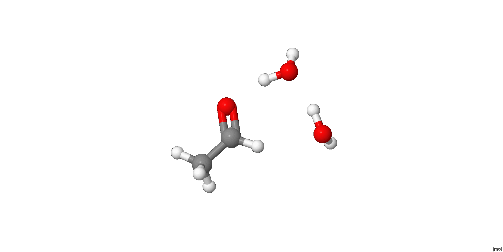

# The `aa` dataset: diagnosing and fixing a computational recipe

A second real example alongside [`caa`](../caa/) - this one tells a
different kind of story. Where `caa` is about exploring a mechanism,
`aa` is about something every computational chemist eventually runs
into: getting a plausible-looking number that turns out to be wrong,
finding out *why*, and fixing it - twice - against a real, published
experimental benchmark.

## Contents

- [The chemistry](#the-chemistry)
- [Workflow](#workflow)
- [A real methodology bug: PURIFY](#a-real-methodology-bug-purify)
- [Results: the water-assisted model](#results-the-water-assisted-model)
- [Results: the standalone cycle vs. experiment](#results-the-standalone-cycle-vs-experiment)
- [Diagnosing the error, and fixing it - twice](#diagnosing-the-error-and-fixing-it---twice)
- [A closed-out, unresolved crash](#a-closed-out-unresolved-crash)
- [Structure](#structure)
- [Open items](#open-items)
- [Acknowledgements](#acknowledgements)

## The chemistry

Acetaldehyde reacts reversibly with water to form its hydrate - the
same reaction as `caa`'s own chloroacetaldehyde chemistry, but for a
molecule whose hydration equilibrium is well characterised
experimentally. That real, published number is what makes this dataset
useful in its own right: a case where you can check a computational
recipe's absolute numbers against reality, not just its internal
consistency.

This GIF is a quick, fixed-angle illustration, not the real underlying
data. To rotate, zoom, measure distances, or inspect any individual
frame yourself, open [aa001_IRC.cml](./outputs/aa001_IRC.cml) directly
in [Jmol](https://jmol.sourceforge.net/) (free, open-source) - see
[`animation/README.md`](./animation/README.md) for how this GIF itself
was made, including the Jmol script used.

## Workflow

The `aa001` series builds a full mechanistic picture, water-assisted
throughout - a genuine transition state, not just reactant and product
guessed at separately:

1. **`aa001a`/`aa001b`/`aa001c`** - constrained optimisation of the
   acetaldehyde + 2-water complex toward a TS-like structure, at
   `wB97X-D/6-21G+(d,p)/PCM(water)`.
2. **`aa001d`** - genuine, unconstrained `RUNTYP=SADPOINT` search from
   the `aa001c` structure. Converged cleanly (`NSERCH=8`), confirmed a
   genuine first-order saddle point: exactly one imaginary frequency
   (1360.89i cm⁻¹), all six translation/rotation modes at 0.00 cm⁻¹.
3. **`aa001e`/`aa001f`** - forward and backward `RUNTYP=IRC` runs from
   the `aa001d` saddle point.
4. **`aa001g`/`aa001h`** - unconstrained re-optimisation of each IRC
   endpoint. Both converged to genuine minima. Bond-length analysis
   identified `aa001g` as the **hydrate** (two genuine C-OH single
   bonds) and `aa001h` as the **aldehyde** (intact C=O double bond) -
   the forward/backward IRC direction labels don't by themselves tell
   you which side is reactant vs. product; the geometry does.
5. **`aa001-ts-pcseg2`/`aa001g-pcseg2`/`aa001h-pcseg2`** - single-point
   energies at `wB97X-D/PCseg-2/PCM(water)` for the TS and both
   endpoints, giving real barrier heights and a reaction energy for the
   water-assisted mechanism itself.
6. **`aa002-*`** - a separate, standalone hydration thermodynamic
   cycle: bare acetaldehyde, bare hydrate, and a standalone water
   molecule, each optimised and given a `PCseg-2` single point, to
   compute `dG_hydration` directly comparable to the experimental
   literature value.

## A real methodology bug: PURIFY

`aa001a` was built without any `PURIFY` setting, leaving
translation/rotation modes contaminated in the frequency output.
`aa001b` added `PURIFY=.T.` to `$STATPT` - the wrong group; this only
affects the Hessian used internally during the geometry search, not
the final `HSSEND` frequency analysis, and made no measurable
difference. `aa001c` moved `PURIFY=.T.` to `$FORCE`, the correct group
for cleaning up the final analysis Hessian - confirmed directly in
GAMESS's own documentation. This fixed it: all six trans/rot modes came
out cleanly at 0.00 cm⁻¹ from `aa001c` onward. Both false starts are
kept in `inputs/`/`outputs/` rather than deleted, since they document a
genuine, non-obvious GAMESS behaviour worth remembering.

## Results: the water-assisted model

At `wB97X-D/PCseg-2/PCM(water)`, electronic energies only:

| Quantity | Value |
| --- | --- |
| Forward barrier (aldehyde → TS) | 28.84 kcal/mol |
| Reverse barrier (hydrate → TS) | 30.98 kcal/mol |
| Reaction energy (hydration) | -2.14 kcal/mol |

This describes `aldehyde.2H2O -> hydrate.H2O` - one water molecule
staying explicitly complexed throughout, modelling the water-assisted
reaction *mechanism* itself, not the simple, balanced
`aldehyde + H2O -> hydrate` equilibrium the experimental value below
refers to directly. Since this model keeps the *same* molecularity on
both sides, it turns out to matter a great deal for how trustworthy the
thermodynamics are - see below.

## Results: the standalone cycle vs. experiment

Experimental reference: Sorensen & Jencks, *J. Am. Chem. Soc.* 1987,
109, 4675-4690. Reported `K_h = 1.2 ± 0.1` at 25°C, i.e.
`dG_experimental = -0.11 kcal/mol` (54.5% hydrate, 45.5% aldehyde -
essentially thermoneutral). The authors themselves note a "striking
disagreement" among prior literature values (spanning roughly 0.85 to
1.54) before settling on 1.2 via two independent, mutually-agreeing
experimental methods - a genuinely demanding calibration target, not a
casual number to match.

| Quantity | Our result | Experiment |
| --- | --- | --- |
| Electronic + ZPE (0K) | -0.74 kcal/mol | - |
| Enthalpy (298K) | -2.35 kcal/mol | - |
| **Gibbs free energy (298K)** | **+9.42 kcal/mol** | **-0.11 kcal/mol** |

The electronic and enthalpy values are small and qualitatively
consistent with a near-thermoneutral equilibrium. The raw Gibbs free
energy is badly wrong - not just off by a few kcal/mol, but flipped in
sign, predicting essentially all-aldehyde against an experimentally
near-50/50 mixture.

## Diagnosing the error, and fixing it - twice

`-T·dS = dG - dH = +11.8 kcal/mol` here - remarkably close to the
`+11.9 kcal/mol` found for the analogous chloroacetaldehyde calculation
in `caa`. Two independent substrates showing the same large,
same-direction discrepancy is strong evidence of a systematic artefact,
not a one-off error: treating a standalone water molecule's
translational entropy with the ideal-gas formula significantly
overestimates it relative to water's true entropy in the liquid phase.

**Fix 1 - use the water-assisted model instead of the standalone
cycle.** Since the water-assisted model never changes molecularity
between reactant and product side (one 13-atom complex throughout,
unlike the standalone cycle's 2-species-to-1-species change), it should
be far less vulnerable to the same artefact. Computing its full thermal
treatment directly confirms this:

| Quantity | Water-assisted | Standalone | Experiment |
| --- | --- | --- | --- |
| Electronic + ZPE (0K) | +1.29 kcal/mol | -0.74 kcal/mol | - |
| Enthalpy (298K) | -0.11 kcal/mol | -2.35 kcal/mol | -0.11 kcal/mol |
| Gibbs free energy (298K) | +4.27 kcal/mol | +9.42 kcal/mol | -0.11 kcal/mol |

The spurious entropy penalty drops from +11.8 to +4.4 kcal/mol - cut by
more than half, just by using a model that can't lose an entire
molecule's translational freedom as an independently-tumbling unit. The
enthalpy value matches experiment to two decimal places - almost
certainly fortuitous precision given the modest basis/functional
combination, but a good sign this route lands in the right, small,
near-thermoneutral regime.

**Fix 2 - SMD instead of bare electrostatics-only PCM.** SMD (Truhlar
and coworkers) adds empirically-calibrated cavitation, dispersion, and
solvent-structure corrections on top of plain PCM electrostatics.
Applied to the three already-identified stationary points
(re-optimising each from its converged plain-PCM structure):

| Quantity | Plain PCM | SMD |
| --- | --- | --- |
| Gibbs free energy (298K) | +4.27 kcal/mol | **+1.60 kcal/mol** |
| -T·dS = dG - dH | +4.4 kcal/mol | +2.9 kcal/mol |

| Fix applied | dG (298K) | Distance from experiment |
| --- | --- | --- |
| Standalone cycle, plain PCM (baseline) | +9.42 kcal/mol | 9.53 kcal/mol |
| + water-assisted model | +4.27 kcal/mol | 4.38 kcal/mol |
| + SMD | **+1.60 kcal/mol** | **1.71 kcal/mol** |

Two independent, well-motivated methodology changes - neither of them
"just use a bigger basis set" - together took the error from ~9.5
kcal/mol down to ~1.7 kcal/mol, an 82% reduction. The dominant errors
here were statistical-mechanics/solvation-model problems, not
electronic-structure-accuracy problems - identifying which category an
error belongs to mattered more than reflexively reaching for a higher
level of theory.

## A closed-out, unresolved crash

`aa002-aldehyde-bare-smd` (bare acetaldehyde alone under SMD, 7 atoms)
failed repeatedly - `error code 911`/`TCP recv error` at the very first
SCF iteration, across nine independent, genuinely different diagnostic
attempts (different core counts, `EXETYP=CHECK` validation, alternate
`GUESS`, a bare `RUNTYP=ENERGY`, geometry sanity checks - all normal).
Notably, the *same* aldehyde padded with two spectator waters
(`aa001h-smd`) succeeded without issue under identical settings. Closed
out as a likely GAMESS/SMD numerical edge case for very small, isolated
molecules under this specific solvation model - not blocking, since the
water-assisted model already gives a complete result without it. All
four failed diagnostic attempts are kept in `inputs/`/`outputs/` for
the same reason as the `PURIFY` false starts above.

## Structure

- `inputs/` - all GAMESS `.inp` files
- `outputs/` - all GAMESS `.log` files
- `dat/` - all GAMESS `.dat` (PUNCH) and `.rst` (restart) files. Note:
  the `RUNTYP=IRC` jobs (`aa001e`, `aa001f`) have no `.rst` - their
  restart data is written into the `.dat` file instead, per GAMESS's
  own convention.
- `ont/run_notes.tsv` - the real, contemporaneous working notes this
  graph's annotations are built from.

## Open items

- Apply the same standalone hydration cycle and comparison to
  chloroacetaldehyde's own literature value, if one can be found.
- Higher-level electronic structure (larger basis, or a correlated
  method), a quasi-harmonic entropy correction for low-frequency modes,
  a larger explicit microsolvation shell, and conformational sampling
  are all real, plausible next steps for closing the remaining ~1.7
  kcal/mol gap - none yet attempted.

## Acknowledgements

Experimental reference: Sorensen, T. S. & Jencks, W. P.
*J. Am. Chem. Soc.* 1987, 109, 4675-4690.
