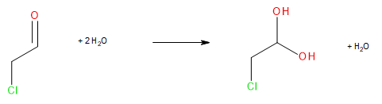
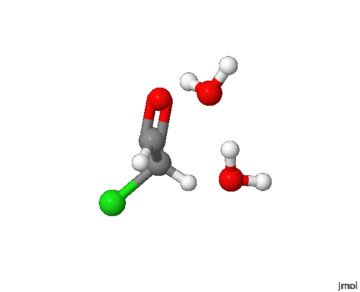
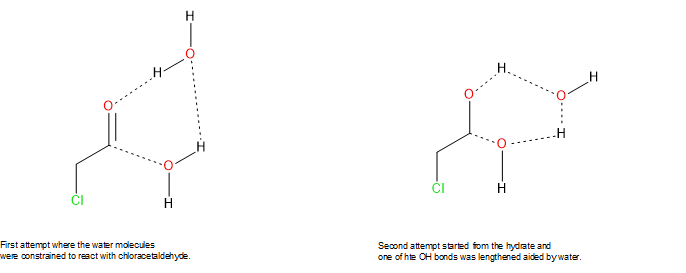

# The `caa` dataset: a real, messy, eventually-organised project

Unlike the [bundled `rem01` example](../README.md), this isn't a clean,
built-from-scratch demonstration. It's a real, complete computational
chemistry project - wrong turns, dead ends, and all - kept exactly as
it actually happened, because that's precisely the point.

**If you're new to this repo, start with the bundled `rem01` example
first.** This one assumes you already understand the basics and shows
something different: what real, exploratory research actually looks
like, and how this project's own tooling helps bring it back under
control once it starts to sprawl.

## Contents

- [Why this exists](#why-this-exists)
- [The chemistry](#the-chemistry)
- [Phase 1: Exploration](#phase-1-exploration)
- [Phase 2: Refinement, and two real complications](#phase-2-refinement-and-two-real-complications)
- [Phase 3: A consistent, corrected answer](#phase-3-a-consistent-corrected-answer)
- [The hydration equilibrium](#the-hydration-equilibrium)
- [Querying this dataset](#querying-this-dataset)
- [Structure](#structure)
- [Acknowledgements](#acknowledgements)

## Why this exists

Most examples show you the answer. This one shows you the *process* -
including the part every real computational project goes through:
dozens of exploratory runs, a promising method that turns out to be
subtly broken, and the moment you step back and realise you need to
actually organise what you've done before you lose track of it
entirely.

That moment is real and it's in here: `ont/run_notes.tsv` has over 30
entries, many of them genuine debugging trails - a calculation that
crashed, a control experiment run specifically to rule out one
explanation in favour of another, a confirmed fix. None of this was
written after the fact for a tutorial. It's the actual record,
captured as it happened, queryable directly from the graph alongside
the calculations it describes.

## The chemistry

The reaction of chloroacetaldehyde with water to form its hydrate -
relevant to understanding what fraction of the aldehyde in an aqueous
system is actually available to react as an aldehyde, rather than
being tied up as the hydrate.





This GIF is a quick, fixed-angle illustration, not the real underlying
data. To rotate, zoom, measure distances, or inspect any individual
frame yourself, open [caa005bIRC.cml](./outputs/caa005bIRC.cml)
directly in [Jmol](https://jmol.sourceforge.net/) (free, open-source) -
see [`animation/README.md`](./animation/README.md) for how this GIF
itself was made, including the Jmol script used.

## Phase 1: Exploration

The first strategy - bringing chloroacetaldehyde and water together
directly, holding candidate reacting centres closer with distance
constraints (AM1, then 3-21G once AM1 turned out not to support
constraints at all) - didn't converge to anything useful, despite
numerous variations.



The strategy that actually worked came from the other direction:
starting from the *product* (the hydrate, with one spectator water
already present), then deliberately lengthening one of its C-O bonds
while holding the incoming/departing water's hydrogen bonds in place
via distance constraints. The specific geometry where this paid off -
the one shown above - has an exact, queryable signature: a particular
pair of constraint distances (water-oxygen-to-proton and
water-proton-to-oxygen, both set to 1.2 Å) that a SPARQL query against
this graph can find directly, by constraint type and target value -
covered in more depth in ["Querying this dataset"](#querying-this-dataset)
below.

The geometry from this approach, run at a higher level of theory
(6-31G(d,p), with `PROJCT=.TRUE.` to confirm zero-frequency
translations/rotations) gave a genuine starting point for locating the
transition state and, from it, both directions of the intrinsic
reaction coordinate (IRC) - stitched together into one combined
trajectory using wxMacMolPlt.

See `ont/run_notes.tsv` for the real, contemporaneous account of every
step in this phase, including the ones that didn't work.

## Phase 2: Refinement, and two real complications

The transition state geometry was first used for a very high level
single-point energy scan (CCSD(T)/aug-cc-pVTZ) - later set aside in
favour of a fresh refinement carried out on
[ARCHER2](https://www.archer2.ac.uk), the UK National Supercomputing
Service, using a newly built GAMESS (US) installation there.

> This work used the ARCHER2 UK National Supercomputing Service
> (https://www.archer2.ac.uk).
>
> Beckett, G., Beech-Brandt, J., Leach, K., Payne, Z., Simpson, A.,
> Smith, L., Turner, A., & Whiting, A. (2024). *ARCHER2 Service
> Description*. Zenodo. https://doi.org/10.5281/zenodo.14507040

Two real complications arose along the way, both worth recording since
they affect how every number below should be read.

**First**, on revisiting the combined IRC trajectory, its geometries
turned out to have been generated at a different, lower level of
theory than either the original transition-state work or the intended
target level - confirmed by matching its embedded basis exponents to a
classic Pople 6-31G(d) contraction, and by an energy discrepancy of
roughly 274 Hartree at the shared starting geometry, far too large to
be a basis-quality effect. The IRC's first and last geometries
therefore needed re-optimising properly, rather than being used
directly as single points.

**Second**, attempting to reproduce a large, high-quality basis
(`def2-TZVPP`, in the same spirit as the original CCSD(T)/aug-cc-pVTZ
work) via a custom-supplied basis set (`BASNAM`/`EXTFIL`) uncovered a
reproducible, GAMESS-build-specific fault: below a certain size, a
custom basis crashes with a low-level BLAS error
(`DGEMM parameter 13 had an illegal value`); at full size, it instead
*silently* produced an incorrect total energy - off by roughly 270
Hartree from the chemically expected value, with no error at all.
GAMESS's own built-in basis sets were confirmed unaffected (the
bundled 49-test example suite passed 46/49 exactly). The likely root
cause was traced into GAMESS's Hückel-guess source
(`guess.src`, subroutine `COPROJ`): the internal projection step sizes
an array using only the electron count and its own minimal reference
basis, never the actual target basis size - which would specifically
explain a failure tied to small custom bases. Full details, including
the source-level trace, are in `gamess-dgemm-bug-report.md` in this
folder, and were reported to the GAMESS Google Group (see
[Acknowledgements](#acknowledgements)).

Given this, the refinement instead uses GAMESS's native `PCseg-2`
basis (Jensen's Polarization Consistent family, roughly
cc-pVTZ-equivalent quality) - confirmed to reproduce the chemically
expected energy cleanly, with no trace of the fault:

| File | Point | Basis | Energy (Hartree) | Status |
|---|---|---|---|---|
| *(custom `def2-TZVPP` attempt)* | 1st IRC point | `def2-TZVPP` (custom `BASNAM`/`EXTFIL`) | off by ~270 Hartree | **Wrong** - broken custom basis construction, see above |
| `caa005bIRC-pcseg2-test.log` | Same geometry | `PCseg-2` (native) | chemically correct | Confirmed correct - resolved the whole saga |

`inputs/def2tzvp_ext.bas` is the actual custom basis data behind the
`EXTFIL` attempts above - kept as real supporting material for this
investigation, even though it isn't itself a GAMESS input or output
file. **It isn't tracked by the graph** - `process_gamess_directory()`
records each experiment's own `.inp`/`.log`/`.dat` files, but nothing
in this project's pipeline was built to follow an *auxiliary* file an
`.inp` merely references at runtime, rather than being itself. So
querying the graph for it (via SPARQL or `summarize_graph()`) won't
find anything - not a bug, just outside what the extraction was ever
designed to capture.

## Phase 3: A consistent, corrected answer

The first and last IRC geometries and the transition-state geometry
were each re-optimised at a consistent bridging level,
`wB97X-D/6-31G(d,p)/PCM(water)`, and confirmed by frequency analysis:
zero imaginary frequencies for both endpoints (genuine minima), exactly
one imaginary frequency (1195.01i) for the transition state (genuine
first-order saddle point).

**Thermochemistry at the bridging level:**

| ScanNo | ZPE (Ha) | Enthalpy (kJ) | Entropy (J/mol·K) | Gibbs Free Energy (kJ) | Level of theory | Notes |
|---|---|---|---|---|---|---|
| `caa007a` | 0.099784 | 290.804 | 414.046 | 167.356 | wB97X-D/6-31G(d,p) PCM(water) | 1st IRC point |
| `caa007b` | 0.104032 | 297.446 | 374.576 | 185.767 | wB97X-D/6-31G(d,p) PCM(water) | Last IRC point |
| `caa005bTSb` | 0.097427 | 276.788 | 351.778 | 171.906 | wB97X-D/6-31G(d,p) PCM(water) | Transition state |

**Electronic energy at each geometry, PCseg-2:**

| File | ScanNo | Electronic energy (Ha) | Level of theory |
|---|---|---|---|
| `caa007a-pcseg2.log` | `caa007a-pcseg2` | −766.3719959497 | wB97X-D/PCseg-2 PCM(water) |
| `caa007b-pcseg2.log` | `caa007b-pcseg2` | −766.3839610278 | wB97X-D/PCseg-2 PCM(water) |
| `caa005bTSb-pcseg2.log` | `caa005bTSb-pcseg2` | −766.3338684973 | wB97X-D/PCseg-2 PCM(water) |

Combining the high-accuracy PCseg-2 electronic energies with the
6-31G(d,p) thermal corrections (a standard mixed-level approach -
thermal/ZPE corrections are far less basis-sensitive than the raw
electronic energy) gives real, complete answers - not just an
electronic-energy estimate:

| Quantity | Electronic only (0K) | ZPE-corrected (0K) | ΔH‡ (298.15K) | ΔG‡ (298.15K) |
|---|---|---|---|---|
| Forward barrier (kcal/mol) | 23.93 | 22.45 | 20.58 | 25.01 |
| Reverse barrier (kcal/mol) | 31.43 | 27.29 | 26.50 | 28.12 |
| Reaction energy (kcal/mol) | −7.51 | −4.84 | −5.92 | −3.11 |

ΔG‡ is the quantity most directly comparable to experimental rate data
via transition state theory - notably larger here than the bare
electronic or enthalpy barriers, reflecting a real entropy cost from
forming the more constrained transition-state geometry.

**These numbers are not yet independently validated against the
literature.** Benchmarking against a similar, well-characterised
structure is planned as separate, future work.

## The hydration equilibrium

The IRC work above keeps one water molecule complexed to the substrate
throughout - the right approach for the reaction *mechanism*, but not
by itself the standard hydration equilibrium
(aldehyde(aq) + H₂O ⇌ hydrate(aq)) needed to estimate the relative
proportions of aldehyde and hydrate actually present. The two also
differ by a whole water molecule in formula, so a separately computed
water molecule is needed to balance the equation.

Three further structures were computed - bare aldehyde, bare hydrate
(each extracted from the corresponding IRC-endpoint cluster by
removing spectator waters, confirmed via bond-length analysis - see
`run_notes.tsv` for the specific distances used), and standalone
water - each optimised and characterised at the same bridging level,
then given a PCseg-2 single point, following the identical recipe as
above.

One genuine mechanistic finding worth calling out: this bond-length
analysis confirmed the reaction incorporates one of the two *original*
spectator waters into the product gem-diol via a proton relay, not
simply "a" water in the abstract - a real, specific detail about how
the mechanism actually proceeds, not an assumption.

| Quantity | ΔG(hydration) |
|---|---|
| Electronic + ZPE (0K) | −4.44 kcal/mol |
| Internal energy (298.15K) | −5.40 kcal/mol |
| Enthalpy (298.15K) | −5.99 kcal/mol |
| Gibbs free energy (298.15K) | +5.88 kcal/mol |

The sign flip in the Gibbs free energy row is real and worth
explaining, not hiding: it traces entirely to the entropy term
(−TΔS ≈ +11.9 kcal/mol at 298.15K), large enough alone to overturn an
otherwise clearly favourable enthalpy. This is very likely a
methodological artefact rather than real chemistry - a "standalone"
water computed this way is treated as an ideal gas, with far more
translational/rotational entropy than a water molecule genuinely has
once embedded in the hydrogen-bonded liquid it's actually drawn from.
On this basis, the enthalpy estimate (favouring the hydrate by ~6
kcal/mol) is judged more reliable than the raw Gibbs free energy,
pending a proper solution-phase entropy correction for water - a
planned acetaldehyde calibration (same method, known literature
equilibrium available for comparison) will test this directly.

This kind of result - real chemistry, a real methodological limitation
identified and explained rather than glossed over, and a concrete,
falsifiable plan to resolve it - is exactly the kind of thing this
project's tooling is meant to help keep straight as a real project
grows, not just a clean final number.

## Querying this dataset

`query_caa.R` has real, specific queries actually used against this
data - not a generic tutorial. Compare its imaginary-frequency check
against the equivalent one-line call:

**Raw SPARQL** (from `query_caa.R`):
```sparql
SELECT ?spectrum ?freq WHERE {
  ?spectrum gc:hasFrequencyPeak ?peak .
  ?peak gc:hasFrequency ?fv .
  ?fv gc:hasFloatValue ?freq .
  FILTER(?freq < 0)
}
ORDER BY ?spectrum ?freq
```

**The tiered-tool equivalent:**
```r
summarize_graph("ont/caa_graph_20260905.ttl")
```

Getting correct results from the SPARQL version requires knowing
SPARQL syntax, this graph's real property names, and non-obvious
lessons like `FILTER` vs. a direct literal match (a bare number in a
triple pattern parses as `xsd:decimal`, which won't match `xsd:float`
data as an exact term). `summarize_graph()` needs none of that.

If you want to go further - including finding the specific constraint
geometry mentioned in [Phase 1](#phase-1-exploration) above - the
queries in `query_caa.R` are real working examples to unpick and adapt
yourself. For a proper, from-scratch tutorial on writing your own
SPARQL against a graph like this,
[`gamess_functions/examples/query_your_ontology.R`](https://github.com/Darren01/gamess_functions/blob/master/examples/query_your_ontology.R)
has a full tiered primer, built from real lessons this project
actually hit along the way.

## Structure

This follows the [recommended multi-project folder structure](../../README.md#recommended-folder-structure-for-more-than-one-project)
from the main `ont_mm` README - this is that recommendation, in
practice, on a real project:

```
examples/caa/
├── README.md                    (this file)
├── inputs/                       real .inp files, unchanged
├── outputs/                      real .log files (+ .cml), unchanged
├── dat/                          real .dat/.rst files, unchanged
├── gamess-dgemm-bug-report.md    the full DGEMM bug trace (Phase 2)
├── ont/                          templates, instances, built graph,
│                                 run_notes.tsv
└── query_caa.R                   real, project-specific queries
```

## Acknowledgements

Computational resources: the ARCHER2 UK National Supercomputing
Service (see [Phase 2](#phase-2-refinement-and-two-real-complications)
above). The `PCseg-2` suggestion that resolved the `def2-TZVPP` saga
traces back to a post by Eric Patterson on the GAMESS Google Group,
recommending it to a different user some years earlier
([the original thread](https://groups.google.com/g/gamess/c/QIGH16uVZzw/m/Lm6ZT3LZCAAJ)) -
along with other helpful discussion from the wider GAMESS Google Group
community, including the thread reporting the DGEMM/custom-basis fault
described above ([thread](https://groups.google.com/g/gamess/c/c7s8a4qXNAE)).

This project's tooling (`gamess_functions`/`ont_mm`, including this
example's own organisation) was built with Claude (Anthropic) as a
technical collaborator throughout.
